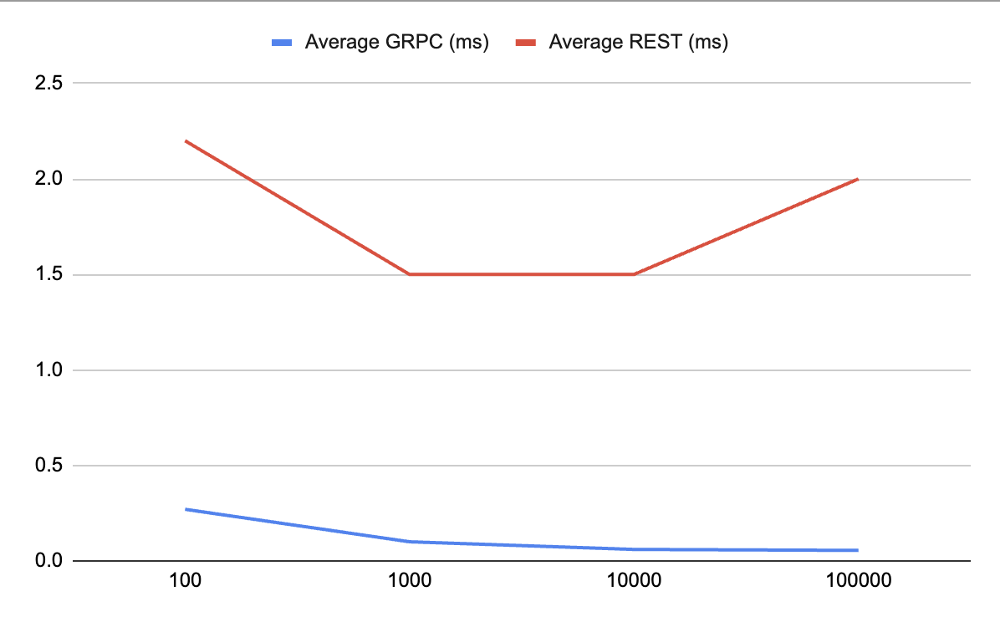
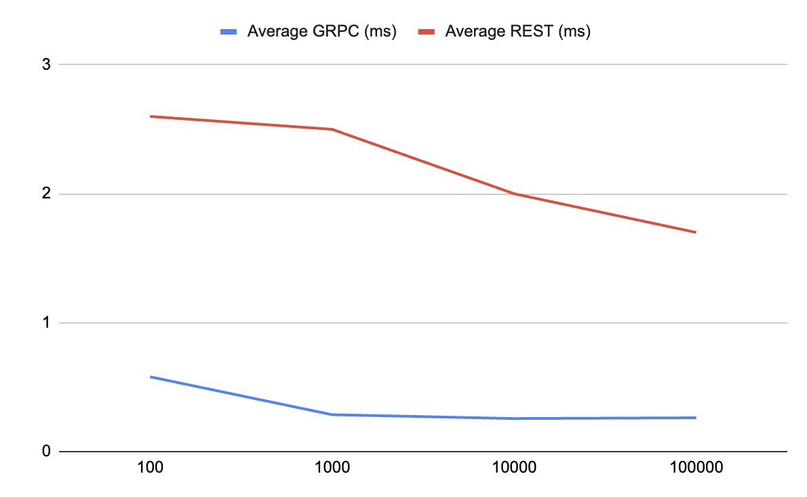

# POC GRPC vs HTTP
The proposal of this PoC is discover how fast gRPC can be comparing to REST.

## Turn On Servers
To turn on the servers you can use the makefile shortcut.

Turn On GRPC server:
```shell
$ make grpc-server
```

Turn On REST server:
```shell
$ make rest-server
```

## Run the tests
To test the requests you just need to run the makefile shortcut.

If you need to send 1000 requests to GRPC server, you run:
```shell
$ make REQUESTS=1000 grpc-client
```

If you need to send 1000 requests to REST server, you run:
```shell
$ make REQUESTS=1000 rest-client
```

## Results with 10 users on response



<table>
    <tr>
        <th>10 users</th>
        <th>Average REST (ms)</th>
        <th>Average GRPC (ms)</th>
    </tr>
    <tr>
        <td>100</td>
        <td>2.2</td>
        <td>0.270</td>
    </tr>
    <tr>
        <td>1.000</td>
        <td>1.5</td>
        <td>0.1</td>
    </tr>
    <tr>
        <td>10.000</td>
        <td>1.5</td>
        <td>0.06</td>
    </tr>
    <tr>
        <td>100.000</td>
        <td>2</td>
        <td>0.055</td>
    </tr>
</table>


## Results with 1000 users on response



<table>
    <tr>
        <th>1000 users</th>
        <th>Average REST (ms)</th>
        <th>Average GRPC (ms)</th>
    </tr>
    <tr>
        <td>100</td>
        <td>2.6</td>
        <td>0.580</td>
    </tr>
    <tr>
        <td>1.000</td>
        <td>2.5</td>
        <td>0.286</td>
    </tr>
    <tr>
        <td>10.000</td>
        <td>2</td>
        <td>0.256</td>
    </tr>
        <td>100.000</td>
        <td>1.7</td>
        <td>0.262</td>
    </tr>
</table>


*Ps.:* to change the response data go to ``internal/constants/response.go``